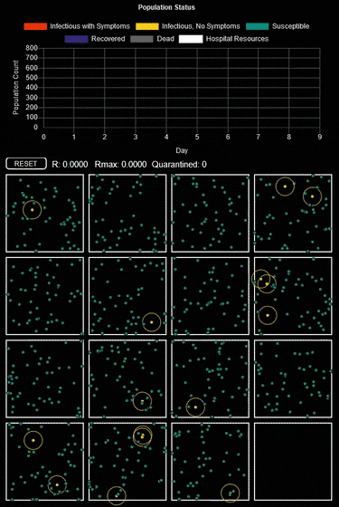
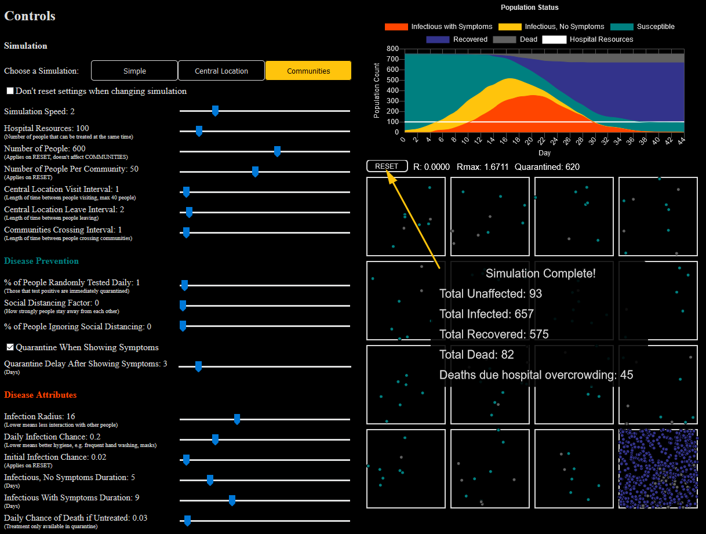
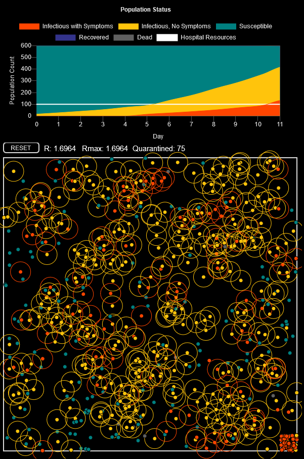

# Simulating An Epidemic
 
Based on [Simulating an Epidemic](https://www.youtube.com/watch?v=gxAaO2rsdIs) by 3Blue1Brown (highly recommended!), this interactive simulation lets the user explore their ideas experimentally and quantitatively in a limited fashion, and to understand the drastic effects minor changes in behaviour can have in our fight against any disease.

The app can be found here: https://immodal.github.io/simulating-an-epidemic/

  

Figure 1: Isolated communites with transit between them

  

Figure 2: Available options

  

Figure 3: Random Walk Simulation

